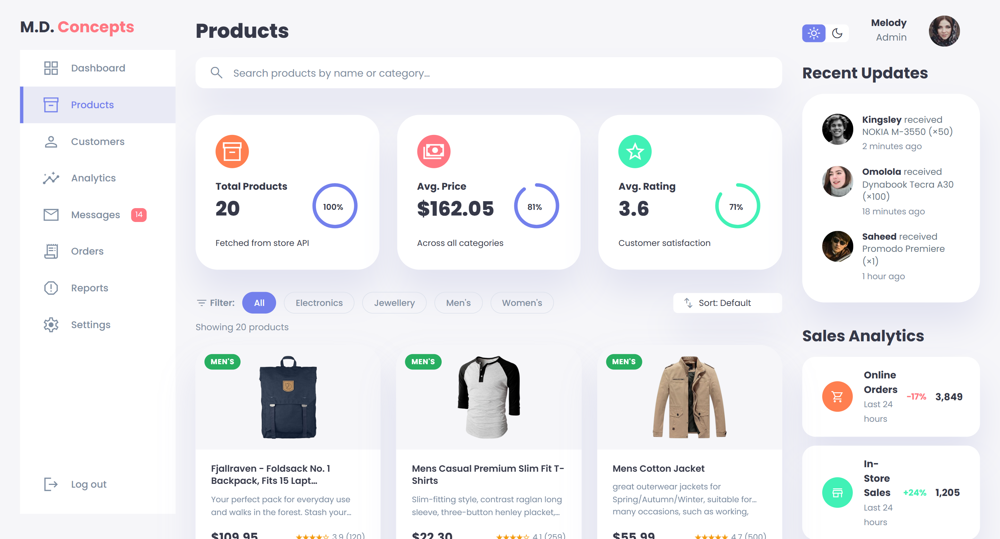

   
    
   
   

  

    
    
    
  

  <h3 align="center">Sample Product Dashboard</h3>

## 📋 <a name="table">Table of Contents</a>

1. 🤖 [Introduction](#introduction)
2. ⚙️ [Tech Stack](#tech-stack)
3. 🔋 [Features](#features)
4. ⭐ [Let's Connect](#follow-me)

## <a name="introduction">🤖 Introduction</a>

A fully responsive admin product dashboard built with vanilla JavaScript. Pulls live product data from the Fake Store API and presents it in a clean, interactive UI — complete with search, filtering, sorting, dark mode, skeleton loading states, and real-time stats. No frameworks, just well-structured vanilla code.

## <a name="tech-stack">⚙️ Tech Stack</a>

- Vanilla JavaScript (ES6+)
- HTML5
- CSS3
- Fake Store API

## <a name="features">🔋 Features</a>

👉 **Live Product Fetching**: Pulls real product data from the Fake Store API on load, with graceful error handling and a one-click retry option.

👉 **Skeleton Loading States**: Placeholder cards pulse while data loads, keeping the UI polished instead of blank during network requests.

👉 **Search & Clear**: Real-time search filters products by name, description, or category as you type, with a one-click clear button.

👉 **Category Filtering**: Instantly narrow results to Electronics, Jewellery, Men's, or Women's Clothing via filter buttons.

👉 **Multi-mode Sorting**: Sort the product grid by price (low–high or high–low), top rating, or name A–Z.

👉 **Live Stats Cards**: Dashboard insights auto-calculate total product count, average price, and average customer rating from the fetched data.

👉 **Dark / Light Theme**: A toggle in the top bar switches the entire UI between light and dark modes seamlessly.

👉 **Responsive Sidebar**: Collapsible navigation drawer for mobile viewports, with full sidebar visibility on larger screens.

👉 **XSS-safe Rendering**: All product content is HTML-escaped before injection, preventing cross-site scripting vulnerabilities.

👉 **Sales Analytics Panel**: At-a-glance view of online orders, in-store sales, and returns with percentage change indicators.

## <a name="follow-me">🤝🏾 Let's Connect</a>
**Hey there! Interested in working with me?** 
Connect with me on [LinkedIn](https://www.linkedin.com/in/themelodyemmanuel) or shoot me an [email](mailto:melodyemmanuel152@gmail.com). Tech and career opportunities only, please 👀

Don't forget to (kindly) leave a star ⭐

Looking forward to geeking out together!
 
 
 
